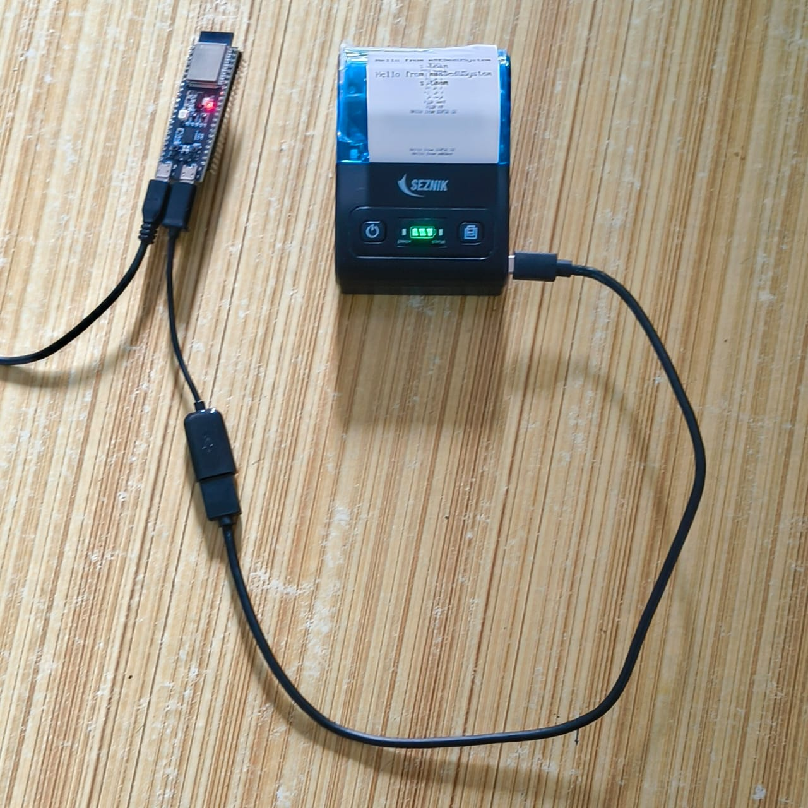

# ESP32 S3 interfacing with USB Host Thermal Printer

Examples using Espressif ESP32 S3 in USB host
mode. The code is based on ESP32 USB host tests and examples included with ESP-IDF. 

To see the sketch output on the serial monitor set the Core Debug Level to
Verbose.

## Software

* Arduino IDE 
* arduino-esp32 2.0.1 or above

## Hardware

* Espressif ESP32 S3 DevKit board
* USB OTG to USB host cable



The USB printer is self-powered which means it is powered by its battery. It
does not need the USB VBUS 5V and does not charge its battery from VBUS.

## dumpdesc -- USB Descriptor Dump

Arduino sketch that shows frequently used USB descriptors in human readable
form.

Sample output
```
[ 15501][I][show_desc.hpp:54] show_config_desc(): bLength: 9
[ 15506][I][show_desc.hpp:55] show_config_desc(): bDescriptorType(config): 2
[ 15513][I][show_desc.hpp:56] show_config_desc(): wTotalLength: 216
[ 15519][I][show_desc.hpp:57] show_config_desc(): bNumInterfaces: 4
[ 15525][I][show_desc.hpp:58] show_config_desc(): bConfigurationValue: 1
[ 15531][I][show_desc.hpp:59] show_config_desc(): iConfiguration: 0
[ 15537][I][show_desc.hpp:64] show_config_desc(): bmAttributes(, Remote Wakeup): 0xa0
[ 15545][I][show_desc.hpp:65] show_config_desc(): bMaxPower: 50 = 100 mA
```
## printHello -- Hello World via USB Host Printer Class

Arduino sketch that is just enough to print one line on a USB thermal receipt
printer. Would be nice to create a subclass from the Arduino stream class so
it appears similar to a Serial device. And an ESC POS library to print in
graphics mode, double wide, italics, bold, etc. Lots more work required.

## serialPrint -- Print text to from serial to Printer

The sketch reads a line from the serial monitor and writes it to the printer.
This proves USB printer communication is working.

